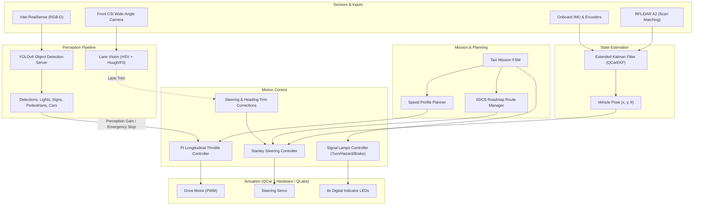

# Autonomous Quanser QCar2 — Autonomous Self-Driving Taxi Fleet

[](https://www.python.org/)
[](https://www.quanser.com/products/qcar/)
[](https://ultralytics.com/)
[](https://www.buffalo.edu/)

> **Project Developed During Research Internship at University at Buffalo (SUNY Buffalo)**  
> An end-to-end autonomous driving stack for the physical Quanser QCar 2 platform and its digital twin in Quanser Interactive Labs (QLabs). Implements an autonomous on-demand taxi mission featuring LiDAR-EKF localization, Stanley path tracking, visual lane keeping, and real-time YOLOv8 perception for traffic signals, signs, pedestrians, and multi-vehicle coordination.

---

## 📌 Table of Contents
- [Overview](#-overview)
- [Key Features](#-key-features)
- [System Architecture](#-system-architecture)
- [Repository Structure](#-repository-structure)
- [Hardware & Software Stack](#-hardware--software-stack)
- [Getting Started](#-getting-started)
  - [1. Virtual Simulation (QLabs)](#1-virtual-simulation-qlabs)
  - [2. Physical QCar 2 Setup](#2-physical-qcar-2-setup)
- [Perception, Planning & Control](#-perception-planning--control)
  - [Mission State Machine](#mission-state-machine)
  - [Localization & State Estimation](#localization--state-estimation)
  - [Path Tracking & Longitudinal Control](#path-tracking--longitudinal-control)
  - [Perception & Obstacle Avoidance](#perception--obstacle-avoidance)
- [Telemetry, Analysis & Calibration](#-telemetry-analysis--calibration)
- [Acknowledgments](#-acknowledgments)

---

## 🚀 Overview

The goal of this project is to develop an autonomous mobility-on-demand (taxi) system using the **Quanser QCar 2** scale platform and the **SDCS (Self-Driving Car Studio)** roadmap. 

The vehicle autonomously navigates between designated passenger pick-up and drop-off hubs, halts for passenger boarding/alighting with realistic vehicle signaling, respects traffic signals and regulatory signs (Stop, Yield), slows down and yields at roundabouts and intersections, and avoids dynamic obstacles and pedestrians.

The codebase supports seamless **Sim-to-Real** transition:
1. **Virtual QLabs World (`virtual_QLabs/`)**: High-fidelity digital twin simulation with synthetic sensor feeds (LiDAR, RGB-D cameras, CSI surround cameras), dynamic pedestrians, and interactive traffic controls.
2. **Physical Hardware (`real_setup/`)**: Embedded deployment on NVIDIA Jetson onboard the physical QCar 2, integrating hardware LiDAR scan-matching GPS, Extended Kalman Filtering (EKF), YOLOv8 object detection server, and real-time low-level PWM motor and steering actuation.

---

## 🌟 Key Features

- **Autonomous Taxi Mission FSM**: Complete lifecycle state machine (`IDLE_HUB` ➔ `NAV_TO_PICKUP` ➔ `PASSENGER_LOADING` ➔ `NAV_TO_DROPOFF` ➔ `PASSENGER_UNLOADING` ➔ `RETURN_TO_HUB`).
- **Stanley Path Tracking Controller**: Non-linear lateral steering controller tracking SDCS roadmap waypoints with cross-track error compensation, heading trim calibration, and search-window re-anchoring to prevent waypoint lockups.
- **Speed Profile Shaping**: Dynamic velocity planning with smooth route-start ramp up, terminal deceleration curves, cornering slowdown caps, and perception-based velocity overrides.
- **LiDAR & EKF State Estimation**: Real-time localization fusing wheel encoders, IMU gyroscopes/accelerometers, and 2D LiDAR scan-matching against reference point clouds via Extended Kalman Filtering.
- **YOLOv8 Deep Learning Perception**: Real-time multi-class object detection detecting Stop signs, Yield signs, Traffic lights (Red/Yellow/Green), Pedestrians, and other QCars with 3D depth-aligned bounding boxes.
- **Vision-Based Lane-Keeping Assist**: Secondary lane-centering trim using front CSI camera HSV segmentation, linear regression lane fitting, and low-pass filtering.
- **Digital Twin Simulation**: QLabs scenario with passenger spawning, dynamic obstacle corridors, traffic light controllers, and interactive top-down roadmap debugging displays.
- **Multi-Vehicle Support**: Non-conflicting node pools allowing multiple autonomous taxis to operate concurrently without route collision.
- **Diagnostics & Telemetry**: Offline and real-time analysis tools (`analyse_run.py`) computing cross-track error statistics (mean, median, 95th percentile) and estimating systematic heading/steering trim biases.

---

## 🏗 System Architecture



---

## 📁 Repository Structure

```text
Autonomous-Quanser-QCar/
├── real_setup/                          # Physical hardware deployment on QCar 2
│   ├── config.txt                       # Network IPs, active application, and CLI arguments
│   ├── config.sh                        # Environment configuration script
│   ├── run_all_cars.bat / .sh           # Master launch script for physical vehicle fleet
│   ├── stop_all_cars.bat / .sh          # Emergency stop and process termination
│   ├── ssh_setup.bat / .sh              # Automated SSH key and connection configuration
│   ├── fetch_log.sh                     # Download telemetry CSV logs from QCar Jetson
│   ├── qcar/                            # Onboard control & perception software
│   │   ├── taxi_control.py              # Main vehicle execution loop (Hardware + EKF + YOLO + FSM)
│   │   ├── taxi_mission.py              # Mission FSM, Route planner, Speed profile, Stanley controller
│   │   ├── yolo_server.py               # Real-time YOLOv8 inference server with aligned depth
│   │   ├── lane_vision.py               # Camera-based yellow lane line detection & steering trim
│   │   ├── vehicle_control.py           # Standard benchmark vehicle control baseline
│   │   ├── utils.py                     # UDP/TCP communication and YOLO drive logic handlers
│   │   └── run_car.sh                   # Onboard launcher script executed via SSH
│   ├── python/                          # Host PC calibration & telemetry analysis
│   │   ├── analyse_run.py               # CSV log analysis (cross-track error, heading/steer bias)
│   │   ├── calibrate.py                 # LiDAR reference scan capture and calibration
│   │   ├── observer.py                  # Live video stream and telemetry monitor
│   │   ├── start.py / stop.py           # Remote start/stop helpers
│   ├── reference_scan/                  # Reference point clouds for LiDAR localization (.mat)
│   └── tests/                           # Unit tests for mission FSM, controllers, and lane vision
│       ├── test_taxi_mission.py
│       └── test_lane_vision.py
│
└── virtual_QLabs/                       # Virtual simulation environment (Digital Twin)
    ├── Taxi.py                          # Full-featured autonomous taxi controller for QLabs
    ├── Setup_Real_Scenario.py           # Scene generator (spawns QCar, passengers, traffic lights)
    ├── core/roadmap/                    # Roadmap definition, raster maps, node coordinates
    ├── hal/                             # Hardware Abstraction Layer (QCar, sensors, math)
    └── pal/                             # Product Abstraction Layer (communication, utilities)
```

---

## 🧰 Hardware & Software Stack

### Hardware
- **Vehicle Platform**: Quanser QCar 2 (1:10 scale autonomous vehicle)
- **Compute Unit**: NVIDIA Jetson Orin / Xavier onboard computer
- **Perception Sensors**:
  - Intel RealSense Depth Camera (RGB-D)
  - 360° 2D RPLiDAR A2
  - CSI Wide-Angle Front Camera (1640x820)
  - Built-in 9-DOF IMU & Optical Wheel Encoders
- **Actuators**: DC Drive Motor with integrated encoder, High-torque steering servomotor, 8x digital indicator/brake/headlamp LEDs

### Software & Libraries
- **Language**: Python 3.10+
- **Deep Learning**: Ultralytics YOLOv8, PyTorch, TensorRT (FP16 optimized)
- **Computer Vision**: OpenCV, NumPy, SciPy
- **Control & Localization**: Quanser PAL / HAL SDK, Extended Kalman Filter (EKF)
- **Simulation**: Quanser Interactive Labs (QLabs) & Quanser Virtual Labs SDK (`qvl`)

---

## 💻 Getting Started

### 1. Virtual Simulation (QLabs)

To run the full autonomous taxi mission inside Quanser Interactive Labs:

1. **Launch QLabs**:
   Open Quanser Interactive Labs and select the **Self-Driving Car Studio (SDCS)** environment.

2. **Spawn the Environment & Actors**:
   ```bash
   cd virtual_QLabs
   python Setup_Real_Scenario.py
   ```
   This initializes the roadmap, spawns the QCar at Hub Node 10, sets up traffic lights, and spawns passengers.

3. **Run the Autonomous Taxi**:
   ```bash
   python Taxi.py
   ```
   *Optional configuration flags (via environment variables):*
   - `ACC_RANDOM_DROPOFF=1` (randomizes passenger drop-off destination)
   - `ACC_SHOW_MAP_DEBUG=1` (renders top-down live path-tracking UI)
   - `ACC_CURVE_SLOWDOWN=1` (enables dynamic cornering deceleration)

---

### 2. Physical QCar 2 Setup

1. **Network Configuration**:
   Update `real_setup/config.txt` with your local host IP and QCar IP:
   ```ini
   REMOTE_PATH=/home/nvidia/Documents
   QCAR_IPS=[192.168.2.117]
   CALIBRATE_IP=192.168.2.117
   LOCAL_IP=192.168.2.124
   APP=taxi_control.py
   APP_ARGS=--heading-trim 0.1085 --log run_telemetry.csv
   ```

2. **Establish SSH Connection**:
   ```bash
   cd real_setup
   ./ssh_setup.sh      # On Linux/macOS
   # or ssh_setup.bat  # On Windows
   ```

3. **Start the Fleet**:
   ```bash
   ./run_all_cars.sh   # Launches YOLO server & taxi_control on all configured QCars
   ```

4. **Monitor Live Telemetry (Host PC)**:
   ```bash
   python python/observer.py
   ```

5. **Stop Vehicles**:
   ```bash
   ./stop_all_cars.sh
   ```

---

## 🧠 Perception, Planning & Control

### Mission State Machine
The taxi executes a continuous finite state machine implemented in `taxi_mission.py`:
- `IDLE_HUB`: Rests at Hub Node 10 with hazard flashers, waiting for dispatch request.
- `NAV_TO_PICKUP`: Plans optimal path from Hub to passenger pickup node using the roadmap graph.
- `PASSENGER_LOADING`: Halts at pickup threshold ($\le 0.35\text{ m}$), illuminates brake lights, dwells for 3 seconds for simulated boarding.
- `NAV_TO_DROPOFF`: Dynamically plans path to drop-off node and tracks waypoints.
- `PASSENGER_UNLOADING`: Halts at drop-off zone for fare alighting.
- `RETURN_TO_HUB`: Automatically routes back to central Hub Node to await next ride.

### Localization & State Estimation
Pose estimation $(x, y, \theta)$ fuses three asynchronous sources via an Extended Kalman Filter:
1. Wheel odometry $\Delta s$ and steering geometry kinematics.
2. 9-DOF IMU yaw rate $\omega_z$ and linear accelerations.
3. RPLiDAR scan-matching comparing live 360° point clouds with pre-captured reference scans (`reference_scan/`) to eliminate drift.

### Path Tracking & Longitudinal Control
- **Lateral Controller (Stanley)**:
  $$\delta(t) = \text{wrap\_to\_pi}\left( \psi(t) + \arctan\left(\frac{k \cdot e_{ct}(t)}{\max(|v(t)|, v_{\min})}\right) + \delta_{\text{trim}} \right)$$
  where $\psi$ is path heading error, $e_{ct}$ is signed cross-track error, and $k$ is cross-track gain. Includes a search window projection algorithm to prevent waypoint skipping or locking on sharp curves.
- **Longitudinal Controller (PI + Speed Shaping)**:
  $$u_v(t) = \text{clip}\left(K_p e_v(t) + K_i \int e_v(t) dt, -u_{\max}, u_{\max}\right)$$
  Targets are modulated by distance-to-goal braking ramps, curvature thresholds, and perception overrides.

### Perception & Obstacle Avoidance
- **Deep Learning**: YOLOv8 running in half-precision (FP16) on NVIDIA TensorRT, processing 640x480 RGB frames aligned with depth maps.
- **Safety Logic**:
  - **Traffic Lights**: Detects Red/Yellow/Green signals; triggers stop when red is detected within lookahead distance ($2.0\text{ m}$).
  - **Stop Signs**: Detects regulatory stop signs, initiates a mandatory full 2.0-second stop once bounding box exceeds trigger threshold.
  - **Yield & Roundabouts**: Smoothly throttles speed down to $0.28\text{--}0.30\text{ m/s}$.
  - **Pedestrians & Vehicles**: Dynamic safety corridor monitoring LiDAR points and depth clusters directly ahead of the front bumper ($0.25\text{--}0.45\text{ m}$) to perform emergency braking.

---

## 📊 Telemetry, Analysis & Calibration

After completing test runs on hardware, telemetry CSV files can be downloaded and analyzed using `analyse_run.py`:

```bash
# Fetch latest telemetry log from QCar
./fetch_log.sh

# Run statistical analysis
python python/analyse_run.py run_telemetry.csv
```

### Sample Output:
```text
samples driving: 4820 (24 s)

Lane keeping   (+ = left of the lane centre)
  mean         : +0.0084 m
  median       : +0.0062 m
  95th abs     : 0.0381 m
  out of lane  : 0.0% of the time (|err| > 0.135 m)
  time left of centre : 54%

Straight-line behaviour (1450 samples)
  mean steering held : +0.0120 rad (+0.69 deg)
  mean cross-track   : +0.0041 m
  implied heading error: +0.82 deg

  Heading looks sound; the residual is a steering offset.
  Suggested   : --steer-trim +0.0120  (+0.69 deg)
```
This enables rigorous calibration of hardware mounting offsets, tire wear biases, and camera misalignment.

---

## 🤝 Acknowledgments

This project was developed during a **Research Internship at the University at Buffalo (SUNY Buffalo)**.

Special thanks to:
- Faculty mentors and researchers at **SUNY Buffalo** for project guidance, lab equipment, and testing facilities.
- **Quanser** for the QCar 2 autonomous vehicle research platform, QLabs digital twin simulator, and Python SDKs.
- The open-source robotics and computer vision communities (Ultralytics, OpenCV, NumPy).
